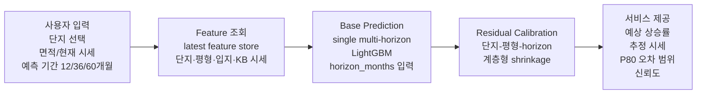

# PPT 2장 모델 설명 제작 지시서

## 목적

이 문서는 PPT 제작자가 아래 2장만 보고 바로 슬라이드를 만들 수 있도록 작성한 제작 지시서다.

- 1장: 사용자 입력부터 ML 추론/보정/서비스 제공까지의 전체 파이프라인
- 2장: 모델 버전별 성능 개선 bar graph와 개선 이유 주석

권장 톤은 "기술적으로 신뢰할 수 있지만 과장하지 않는 발표용 슬라이드"다. 핵심 메시지는 다음이다.

> 단지/평형별 상승률 예측을 위해 하나의 multi-horizon LightGBM 모델을 만들고, 최근 residual 패턴을 계층적으로 보정해 개별 예측 오차를 줄였다.

---

## Slide 1. ML 서비스 파이프라인

### 슬라이드 제목

```text
단지 선택부터 1/3/5년 상승률 예측까지: ML 추론 파이프라인
```

### 한 줄 메시지

```text
사용자가 단지를 선택하면, 최신 단지·평형 feature를 조회하고 multi-horizon LightGBM + 계층형 residual 보정으로 12/36/60개월 상승률과 신뢰도를 반환한다.
```

### 레이아웃

- 비율: 16:9
- 전체 구조: 좌에서 우로 흐르는 5단계 flow chart
- 상단: 제목과 한 줄 메시지
- 중앙: 큰 flow chart
- 하단: 최종 모델 요약 박스 3개

### 중앙 flow chart 구성

도형은 둥근 사각형 5개를 가로로 배치하고, 각 도형 사이에 화살표를 둔다.



### 각 박스에 넣을 문구

#### 1. 사용자 입력

```text
사용자 입력
- 단지/평형 선택
- 현재 KB 매매시세
- 예측 기간: 12/36/60개월
```

보조 주석:

```text
보유 주택 정보는 선택 입력이며, 상승률 예측 자체에는 필수 아님
```

#### 2. Feature 조회

```text
Feature 조회
- KB 매매/전세 시세
- 단지 메타: 구, 면적, 세대수, 연식
- 입지: 역·학교·병원 접근성
- 평당가, 구 대비 프리미엄
```

작은 파일명 캡션:

```text
data/integration/apartment_multihorizon_ver9_latest_features.csv
```

#### 3. Base Prediction

```text
Base Prediction
- ver9b single multi-horizon LightGBM
- horizon_months = 12, 36, 60
- 기간별 모델을 따로 만들지 않음
```

강조 문구:

```text
하나의 모델로 여러 예측 기간 처리
```

#### 4. Residual Calibration

```text
Residual Calibration
- ver16 hierarchical apt-size residual
- 최근 validation residual 사용
- 데이터가 부족하면 넓은 집단 prior로 보정
```

보정 순서 캡션:

```text
평형+horizon → 단지+horizon → 구/면적 그룹 → horizon global → global
```

#### 5. 서비스 제공

```text
서비스 제공
- 1년/3년/5년 예상 상승률
- 추정 시세
- P80 오차 범위
- confidence 표시
```

주의 문구:

```text
60개월은 inference 가능, 단 test window 부족으로 low confidence
```

### 하단 요약 박스 3개

슬라이드 하단에 3개 작은 카드 형태로 배치한다.

1. 모델 구조

```text
단일 multi-horizon LightGBM
horizon_months로 예측 기간 제어
```

2. 최종 보정

```text
ver16 residual calibration
단지-평형별 반복 오차 보정
```

3. 출력값

```text
상승률 + 추정 시세 + P80/P90 + confidence
```

### 디자인 지시

- 배경: 흰색 또는 아주 연한 회색 `#F8FAFC`
- 주요 색상:
  - 사용자 입력/서비스 출력: 신한 블루 계열 `#2563EB`
  - 모델/보정 단계: teal/green 계열 `#0F766E`, `#16A34A`
  - 주의/low confidence: amber `#F59E0B`
- 도형:
  - 둥근 사각형, radius 8px 이하
  - 화살표는 얇고 진한 회색 `#64748B`
- 폰트:
  - 제목 28~32pt
  - 박스 제목 15~17pt bold
  - 박스 본문 10~12pt
- 아이콘 제안:
  - 사용자 입력: cursor 또는 search icon
  - Feature 조회: database icon
  - Base Prediction: chart/brain icon
  - Residual Calibration: sliders/tune icon
  - 서비스 제공: monitor/check icon

### 발표자가 말할 스크립트

```text
사용자는 단지를 고르고 예측 기간을 선택합니다. 앱은 최신 단지-평형 feature store에서 KB 시세, 단지 메타, 입지 접근성, 평당가와 같은 설명 가능한 feature를 조회합니다. 기본 예측은 하나의 multi-horizon LightGBM이 담당하고, horizon_months 값으로 1년, 3년, 5년을 구분합니다. 이후 ver16 residual calibration이 단지-평형 단위로 반복되는 오차를 보정합니다. 최종적으로 상승률뿐 아니라 추정 시세, P80 오차 범위, confidence까지 함께 제공해 숫자를 과신하지 않도록 설계했습니다.
```

---

## Slide 2. 모델 성능 개선 Bar Graph

### 슬라이드 제목

```text
모델 개선 결과: MAE 8.23 → 5.04, 약 38.8% 개선
```

### 한 줄 메시지

```text
단순 feature 추가보다, 서비스 목적에 맞는 multi-horizon 구조와 residual 보정 고도화가 개별 단지/평형 예측 오차를 크게 줄였다.
```

### 그래프 유형

- 세로 막대 그래프
- y축: Test MAE, 단위 `%p`
- 낮을수록 좋은 지표임을 y축 또는 그래프 우측 상단에 표시
- x축: 핵심 milestone 버전
- 막대는 전체 실험 중 서비스 판단에 중요한 버전만 사용

### 그래프 데이터

아래 데이터를 그대로 사용한다.

```csv
version,label,test_mae,annotation,is_final,is_rejected
ver1,구 단위 baseline,9.4061,구 단위 1년 baseline,false,false
ver3,POI 포함 초기형,9.4863,역/학교/병원 feature 추가,false,false
ver7d,12개월 전용 후보,7.1215,개별 단지 12m 전용 보정,false,false
ver9b,multi-horizon base,8.2285,하나의 모델로 12/24/36/48/60m 처리,false,false
ver11,단지 residual,6.8216,단지별 반복 오차 보정,false,false
ver12d,group fallback,6.4376,단지 offset 없는 행도 구/면적 fallback,false,false
ver13,평형 residual,5.4754,단지 안 평형별 오차 차이 반영,false,false
ver14,test blend,5.3811,test 성능은 개선, holdout 미통과,false,true
ver16,최종 ver16,5.0376,계층형 residual shrinkage 최종 채택,true,false
```

### 막대 위 주석 문구

각 막대 위에는 숫자를 크게 쓰고, 중요한 milestone에만 1줄 주석을 단다.

| 버전 | 막대 위 숫자 | 주석 |
|---|---:|---|
| ver1 | 9.41 | baseline |
| ver3 | 9.49 | POI 추가, 개선 제한 |
| ver7d | 7.12 | 12개월 전용은 강함 |
| ver9b | 8.23 | multi-horizon base 확정 |
| ver11 | 6.82 | 단지 residual 효과 |
| ver12d | 6.44 | fallback 보정 |
| ver13 | 5.48 | 평형 residual로 큰 개선 |
| ver14 | 5.38 | test만 개선, holdout 실패 |
| ver16 | 5.04 | 최종: 계층형 shrinkage |

### 그래프 해석 기준

반드시 그래프 안 또는 하단 주석에 아래 문구를 넣는다.

```text
MAE는 상승률 percentage point 기준이며 낮을수록 좋음.
ver14는 test MAE는 낮았지만 validation rolling holdout 안정성 미통과로 최종 제외.
최종 채택 경로 기준 ver9b 8.2285 → ver16 5.0376, 약 38.8% 개선.
```

### 권장 시각 표현

- `ver16` 막대: 진한 파란색 `#2563EB`
- 채택 경로 막대(`ver9b`, `ver11`, `ver12d`, `ver13`, `ver16`): 파란 계열
- 초기/참고 실험(`ver1`, `ver3`, `ver7d`): 연한 회색 또는 연한 파란색
- 제외 실험(`ver14`): 주황색 `#F59E0B` 또는 사선 패턴
- 그래프 하단에 작은 legend:

```text
파란색 = 채택 경로 / 회색 = 탐색·참고 / 주황색 = test 성능은 좋았지만 최종 제외
```

### 보조 Callout 2개

그래프 오른쪽 빈 공간 또는 하단에 callout을 2개 넣는다.

#### Callout 1. 최종 모델

```text
Final Model
ver16_hierarchical_apt_size_residual
single multi-horizon LightGBM + hierarchical residual calibration
```

#### Callout 2. 최종 성능

```text
Test MAE 5.0376%p
RMSE 8.1711
R2 0.7150
Spearman 0.8715
P90 abs error 13.6911%p
```

### 차트 제작 세부 지시

- y축 범위: 0~10
- y축 눈금: 0, 2, 4, 6, 8, 10
- x축 라벨은 `ver1`, `ver3`, `ver7d`, `ver9b`, `ver11`, `ver12d`, `ver13`, `ver14`, `ver16`
- 각 막대 하단 또는 아래 작은 글씨로 한글 label 표시:
  - 구 단위
  - POI
  - 12m 전용
  - multi-horizon
  - 단지 residual
  - fallback
  - 평형 residual
  - blend
  - hierarchical
- `ver14` 막대 위에는 작은 경고 아이콘 또는 `holdout 미통과` 라벨을 붙인다.
- `ver16` 막대 위에는 check icon 또는 `최종 채택` 라벨을 붙인다.
- 그래프 상단에는 점선 화살표로 `8.23 → 5.04 (-38.8%)`를 표시한다. 화살표는 `ver9b`에서 `ver16` 방향으로 연결한다.

### 발표자가 말할 스크립트

```text
초기 모델은 구 단위 baseline으로 MAE가 9%p대였습니다. 단순히 POI feature를 추가하는 것만으로는 큰 개선이 없었고, 12개월 전용 모델은 성능이 좋아졌지만 서비스가 요구하는 1년·3년·5년 공통 인터페이스에는 맞지 않았습니다. 그래서 ver9b에서 하나의 multi-horizon LightGBM 구조를 확정했습니다. 이후 성능 개선의 핵심은 모델을 계속 복잡하게 바꾸는 것이 아니라, validation 기간에서 반복적으로 남는 residual을 단지, 구/면적 그룹, 평형 단위로 보정하는 것이었습니다. 최종 ver16은 평형 residual을 하위 fallback prior 쪽으로 shrinkage해 test와 holdout 양쪽에서 개선됐고, MAE는 ver9b 대비 약 38.8% 낮아졌습니다.
```

---

## PPT 제작자가 주의할 점

1. MAE는 `%`가 아니라 `%p`로 표기한다.
2. `ver14`를 실패처럼 보이게 하지 말고, "test 성능은 좋았지만 검증 안정성 미통과"라고 표현한다.
3. 60개월 예측은 "검증 완료"가 아니라 "inference 가능, low confidence"라고 표현한다.
4. 최종 모델은 `ver16`, base model은 `ver9b`라고 구분한다.
5. 모델 구조는 "단일 multi-horizon LightGBM + residual calibration"이라고 표현한다.

## 근거 파일

- `streamlit/ml_model/docs/model_version_performance_summary.md`
- `streamlit/ml_model/docs/presentation_model_evolution.md`
- `streamlit/ml_model/outputs/performance/VERSION_LOG.md`
- `streamlit/ml_model/outputs/performance/ver06222256_ver16_hierarchical_apt_size_shrinkage.md`
- `streamlit/modules/ml_predictor.py`
